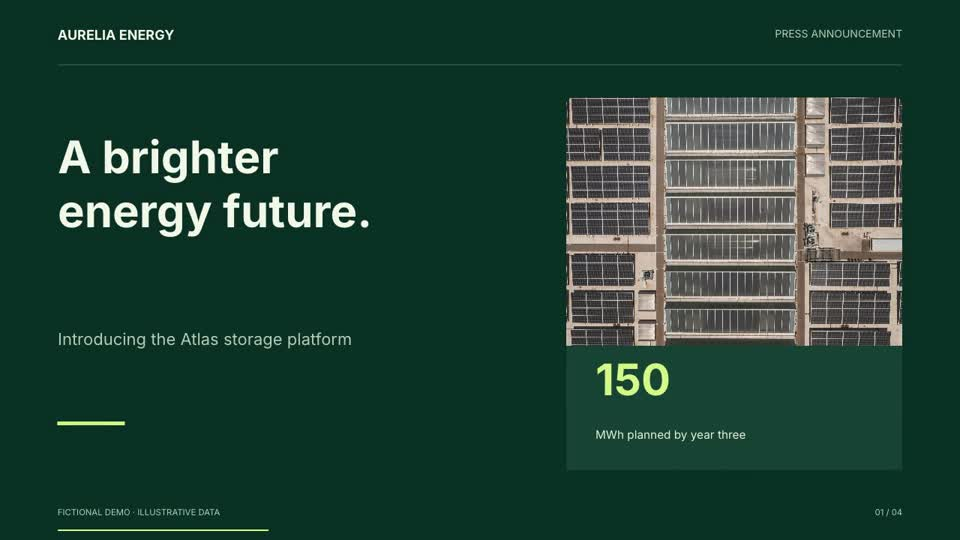

# OpenVid

A standalone open-source video presentation editor with **bring-your-own AI providers**. Start from six complete business examples, edit scenes and animated charts, add narration and music, and export locally with HyperFrames.

[Website and video examples](https://hanishkeloth.github.io/OpenVid/) · [Contribute](CONTRIBUTING.md) · [Provider notes](docs/PROVIDERS.md)



No Palette account or provider key is needed to open the examples, edit, or render existing assets. AI generation uses the accounts you connect.

## Run locally

Requires Python 3.13+, Node 22+, FFmpeg/ffprobe, and a Chromium installation supported by HyperFrames. LibreOffice is needed only for PowerPoint import.

```sh
git clone https://github.com/hanishkeloth/OpenVid.git
cd OpenVid
python3 -m venv .venv
.venv/bin/pip install -r requirements.txt
npm ci
npx hyperframes browser ensure
npm run dev
```

Open **http://127.0.0.1:7795/vids**. Keep this browser profile: its private cookie identifies your workspace. Each new browser profile gets its own six editable sample copies and its own connections.

On macOS, FFmpeg and LibreOffice can be installed with `brew install ffmpeg` and `brew install --cask libreoffice`. On Debian/Ubuntu use the Dockerfile’s system packages. Fonts can differ across systems; the supplied Docker image recipe installs Liberation, DejaVu and Noto fonts.

Optional settings are read from `.env`; copy `.env.example` and edit it. API keys go in **Connections** in the app, where model IDs and the default provider for each task can be changed.

## Included

- Landscape, portrait and square documents; text, shapes, images, video and audio layers.
- Scene timelines, split/reorder/duplicate, trim, speed, volume, fades, native animations and transitions.
- Autosave with revision conflicts, undo/redo, saved version history, comments, trash and templates.
- Six local business examples: press announcement, product launch, quarterly results, sales deck, customer story and team strategy. Each has four scenes, narration, music, photography and a completed 1080p video.
- PDF/PPTX page imports, DOCX/text/Markdown imports, document JSON and SRT subtitles.
- Camera/screen/microphone recording, teleprompter, uploads, stock media search/import.
- AI scene proposals for review before applying; optional full-video production across scenes.
- ElevenLabs voice library, voice design, saved profiles and consent-gated cloning, subject to account access and verification.
- MP4/WebM/GIF export at 720p or 1080p, with 24/30/60 fps options.

This is the standalone OpenVid implementation. It does not provide Google Drive integration, Google Workspace accounts, cross-workspace live collaboration, or complete Google Vids feature parity. PDF/PPTX pages import as images; DOCX imports text. Project JSON alone does not include media files.

## Providers

| Connection | Supported operations |
| --- | --- |
| OpenAI | Scene planning, images, speech, transcription |
| Anthropic | Scene planning and edit proposals |
| Google Gemini | Scene planning and edit proposals |
| ElevenLabs | Speech, transcription, voice library/design/cloning |
| fal.ai | Images, video, speech, music, transcription, video editing, speaking avatars |
| Replicate | Configurable image/video/audio models using prediction APIs |
| OpenAI-compatible endpoint | Operations implemented by that endpoint: chat, images, speech, transcription |
| Pexels / Pixabay / Wikimedia Commons | Stock media; Commons does not require a key |

Connections support **specific provider APIs**, not arbitrary keys from unrelated services. Replicate requires an `owner/model` ID and any required model inputs. fal model inputs can also be customized per task. Custom endpoints must implement the listed OpenAI REST routes. Their schemas, model access, reference-image support and billing may vary; see [provider notes](docs/PROVIDERS.md).

Paid jobs are submitted once and record asynchronous provider IDs. A failed/interrupted job is not retried automatically. Check the provider dashboard before manually retrying an interrupted request. OpenVid reports unknown provider costs as provider-billed, not as free generation.

## Docker and hosting

```sh
docker compose up --build -d
```

The Compose file binds to localhost and persists `openvid-data`. Run one application process per data volume. HyperFrames uses two workers by default. Allow at least 2 CPUs and 4 GB RAM for rendering; larger videos need more memory and disk.

For Railway or another Docker host, deploy this directory as a **separate service**, attach a persistent volume at `/data`, set `OPENVID_DATA_DIR=/data`, and set a strong `OPENVID_ACCESS_TOKEN`. The entrypoint uses the host’s `PORT` environment variable. Use HTTPS and your host’s request/storage limits. The included Railway file uses `/api/health`.

Wait for jobs to finish before restarting or redeploying. Generation and rendering workers are in-process. A stopped server marks unfinished jobs as interrupted on its next start and retains provider request IDs; it cannot resume an interrupted render automatically.

## Data and security

All mutable data lives in `data/` (or `OPENVID_DATA_DIR`). Workspace cookies are unguessable bearer credentials. Documents, uploads, jobs, voices, and encrypted provider settings are isolated by workspace. Encryption uses a generated instance key at `data/.encryption-key`; keep this key with volume backups. The instance administrator can access its storage, including the encryption key.

Do not commit `.env`, `data/`, `.venv/`, or `node_modules/`. Never expose the service publicly without access control. This is a self-hosted workspace model, not a managed multi-tenant SaaS account system. There is no email/password recovery. A server operator can recover a workspace from its data backup; deleting the browser cookie creates a new workspace.

Private-network custom provider URLs are disabled by default. Enable `OPENVID_ALLOW_LOCAL_PROVIDERS=true` only on a trusted self-hosted instance. Keys stay server-side and are never written into exported project documents or sample assets.

## Tests and release packaging

```sh
.venv/bin/pip install -r requirements-dev.txt
.venv/bin/python -m unittest discover -s tests -v
npm test
.venv/bin/python scripts/check_release.py
.venv/bin/python scripts/package_release.py
```

The packaging script uses an explicit source allowlist and writes a source ZIP to `dist/`. It excludes keys, application data, dependencies, caches and local Git state. See [verification](docs/VERIFICATION.md) for tested paths and current limitations.

## Licence and assets

Application code: **AGPL-3.0-only**. Read [LICENSE](LICENSE) and [NOTICE.md](NOTICE.md). The sample photographs and provider-generated media have separate terms and attribution in [ASSETS.md](examples/business/ASSETS.md). Preserve those notices when redistributing. Hosted modified AGPL versions must make their corresponding source available as required by the licence.
